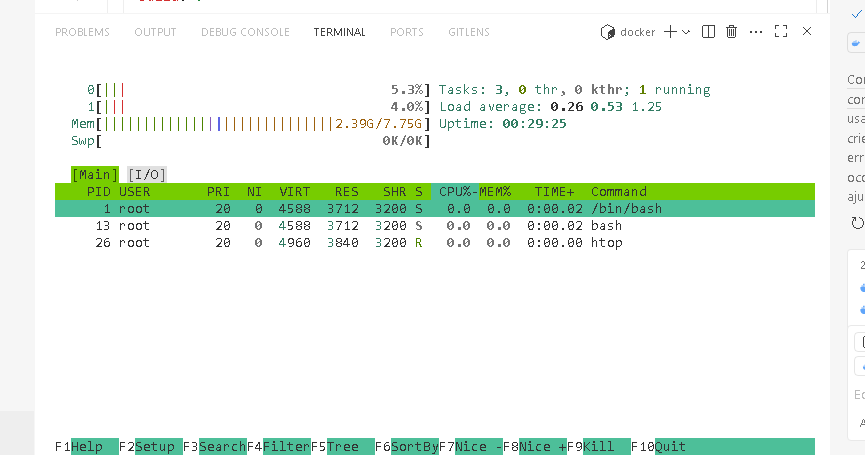

# Pesquisa: Sinais no htop

## proposta da pesquisa
pesquisar a funcionalidade de 15 funções do htop. 

### funções escolhidas:

| Nº | Sinal      | Função                                                                 |
|----|------------|------------------------------------------------------------------------|
|  1 | SIGHUP     | Encerra o processo e recarrega a configuração (hangup).                |
|  2 | SIGINT     | Interrompe o processo (Ctrl+C).                                        |
|  3 | SIGQUIT    | Encerra o processo e gera core dump.                                   |
|  6 | SIGABRT    | Aborta o processo e gera core dump.                                    |
|  9 | SIGKILL    | Encerra imediatamente o processo (não pode ser ignorado).              |
| 10 | SIGUSR1    | Sinal definido pelo usuário 1 (função depende do programa).            |
| 11 | SIGSEGV    | Violação de segmentação (acesso inválido à memória).                   |
| 12 | SIGUSR2    | Sinal definido pelo usuário 2 (função depende do programa).            |
| 13 | SIGPIPE    | Quebra de pipe (processo tentou escrever em pipe sem leitor).           |
| 14 | SIGALRM    | Sinal de alarme (timer expirou).                                       |
| 15 | SIGTERM    | Solicita término do processo de forma amigável.                        |
| 18 | SIGCONT    | Continua um processo parado (SIGSTOP/SIGTSTP).                         |
| 19 | SIGSTOP    | Para (suspende) o processo (não pode ser ignorado).                    |
| 20 | SIGTSTP    | Suspende o processo (Ctrl+Z).                                          |
| 17 | SIGCHLD    | Indica que um processo filho terminou ou parou.                        |

## Referências
- [man 7 signal](https://man7.org/linux/man-pages/man7/signal.7.html)
- [htop manual](https://htop.dev/)
